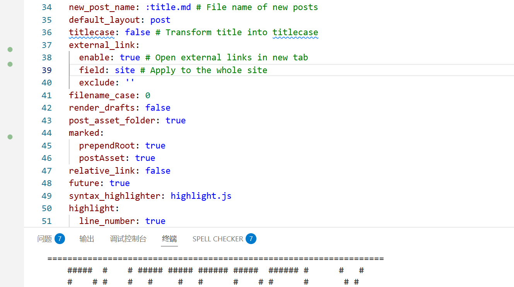
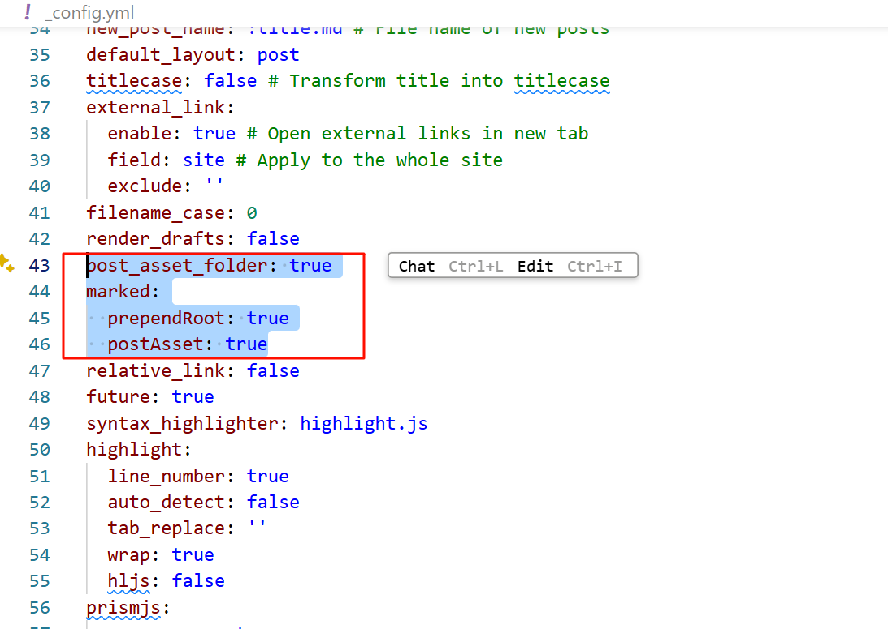
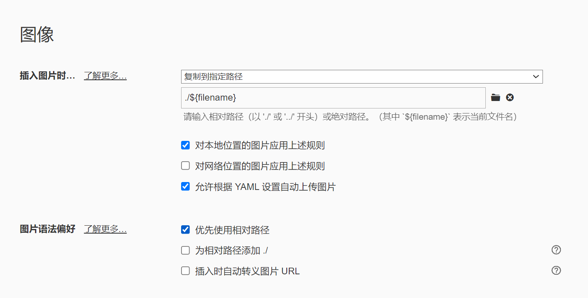
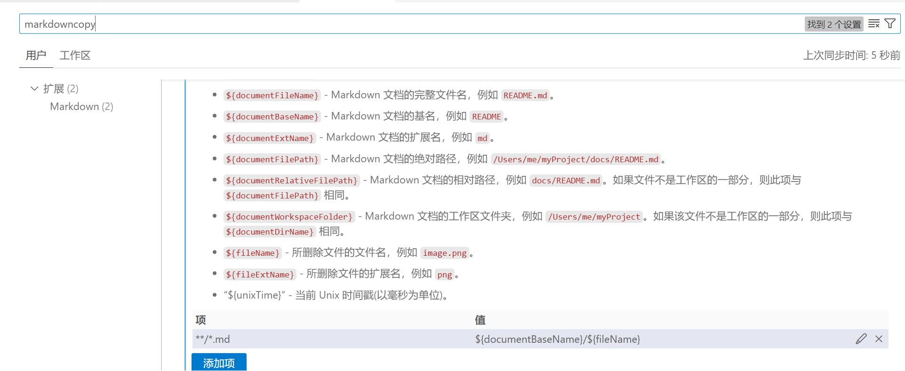

## 注意
gitee图床已经停止服务，建议使用其他图床服务。
推荐smms.app图床免费5g空间

## 第一步设置hexo配置文件
将 _config.yml 文件中的 post_asset_folder 选项设为 true
该操作的目的就是在使用hexo new xxx指令新建md文档博文时，在相同路径下同步创建一个xxx文件夹，而xxx文件夹就是用来存放新建md文档里的图片的




## 第二步设置配置 Markdown 嵌入图片

```
_config.yml
post_asset_folder: true
marked:
  prependRoot: true
  postAsset: true
```




## 第三步设置typroa使用路径




## 第四步设置vscode中markdown复制路径（可选）




## 免费图床推荐
参考
https://sspai.com/post/98911


官方文档：[资源文件夹 | Hexo](https://hexo.io/zh-cn/docs/asset-folders#使用-Markdown-嵌入图片)
